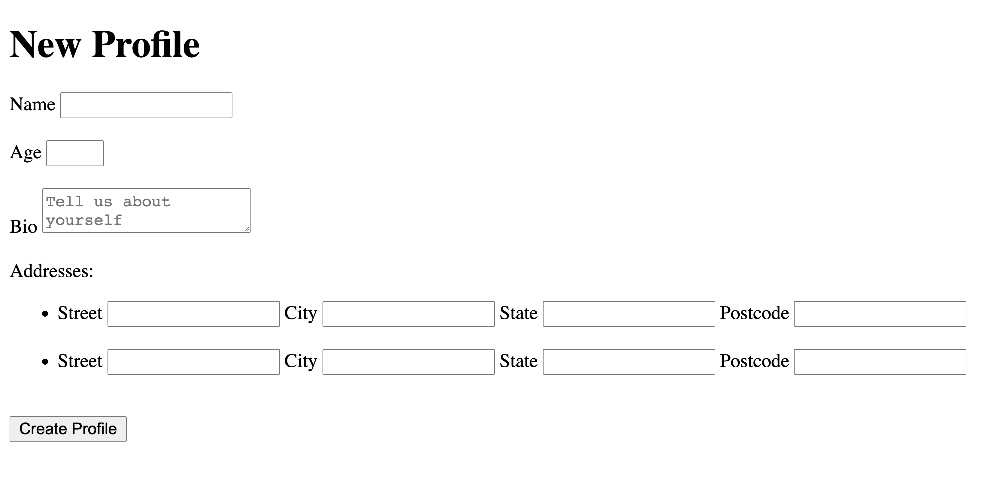

# Rails Profile Form Challenge
## Setup
* Make a fork of this repo
* Clone your fork to your local development environment
* Install dependencies bundle install
* Check node dependencies yarn install --check-files
* rails db:create
* rails db:migrate
* run rails s and check that everything is working (you should see welcome to rails!)

## Starter Template
This starter template has model and controller and database set up for profile and address.View folder contains index, edit, new and show html pages

## Challenge
create a form to capture profile data to match database fields in schema file
and also expore nested form to allow users to enter multiple address fields

Check out the docs and read more about nested forms
https://guides.rubyonrails.org/form_helpers.html#nested-forms

## Advance Challenge : Optional
* edit and delete address form nested in the profile form